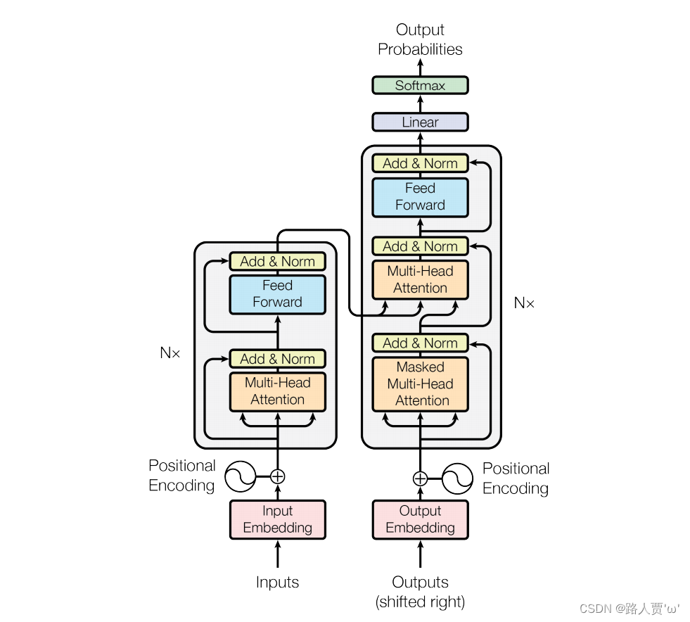
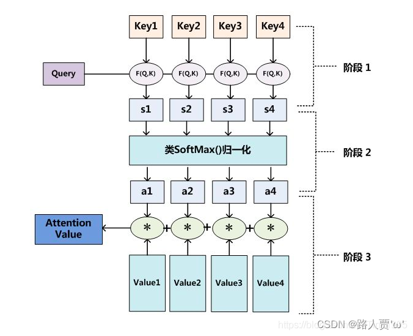
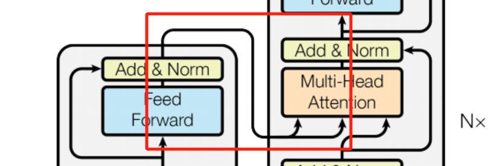
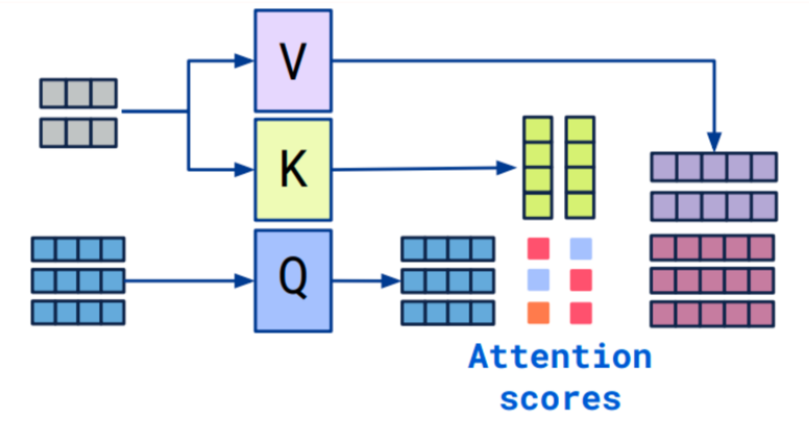

# Transformer

## 结构

Transformer模型可以分为这两个部分：

**1. Encoder**：上图左边部分，其中又有三个部分，**输入、多头注意力机制、前馈神经网络**

- **输入**
- 词嵌入（Input Embedding）：将自然语言转化为与其对应的独一无二的词向量表达
  
-  位置编码器（Position Encoding）：表示单词出现在句子中的位置

- **注意力机制**
  - Multi-Head Attention：由多个Self-Attention组成
  - Self-Attention

- **前馈神经网络**

**2. Decoder**：右边部分，Decoder的第一个Multi-Head Attention采用了Masked操作，最后有一个 Softmax 层计算下一个翻译单词的概率。

- **Linear层**：一个全连接神经网络，把Decoder产生的向量投射到一个比它大得多的、被称作对数几率（logits）的向量里。例如模型从训练集中学习一万个不同的英语单词（模型的“输出词表”），那么对数几率向量为一万个单元格长度的向量——每个单元格对应某一个单词的分数

- **Softmax层**：把分数变成概率（都为正数、上限1.0）。概率最高的单元格被选中，并且它对应的单词被作为这个时间的输出。

## 注意力机制

### 核心概念

输入：Q（query，查询），K（key，键），V（value，值） 

输出：Attention Value

- **查询（Query）**：查询的范围，即主观意识的特征向量。类似搜索时输入的关键词
- **键（Key）**：被比对的项，即物体的突出特征信息向量。类似商品名称
- **值（Value）**：代表物体本身的向量，通常和Key成对出现。类似具体的商品
- **Attention Value**：表示模型关注输入数据中哪些部分的结果

### 计算过程

- **阶段一**：根据输入的Query和Key计算两者之间的相关性或相似性，得到注意力得分（s1,s2,s3,s4）。可以使用不同的方法（即图中的F（Q，K）），例如点积、余弦相似度、MLP网络。
- **阶段二**：对注意力得分进行缩放scale（除以维度的根号），再softmax函数，一方面可以进行归一化，将原始计算分值整理成所有元素权重之和为1的概率分布；另一方面也可以通过softmax的内在机制更加突出重要元素的权重。得到权重系数（a1,a2,a3,a4），这些权重表示查询与每个键的相关性，权重系数越高，说明K越符合要求的Q，则与K对应的V要占更大比重。
- **阶段三**：根据权重系数对Value值进行加权求和，得到Attention Value（此时的V是具有一些注意力信息的，更重要的信息更关注，不重要的信息被忽视了）

### 自注意力机制 Self-Attention

​	自注意力机制想要解决的问题场景是神经网络接收的输入是很多大小不一的向量，并且不同向量向量之间有一定的关系，但是实际训练的时候无法充分发挥这些输入之间的关系而导致模型训练结果效果极差。比如机器翻译(序列到序列的问题，机器自己决定多少个标签)，词性标注(Pos tagging一个向量对应一个标签)，语义分析(多个向量对应一个标签)等文字处理问题。

​	自注意力机制的关键是**Q、K、V来自同一个来源X**。

> 注意力机制和自注意力机制的区别：
>
> 1. 注意力机制的Q和K是不同来源的，例如，在Encoder-Decoder模型中，K是Encoder中的元素，而Q是Decoder中的元素。在中译英模型中，中文句子通过编码器被转化为一组特征表示K，这些特征表示包含了输入中文句子的语义信息。解码器在生成英文句子时，会使用这些特征表示K以及当前生成的英文单词特征Q来决定下一个英文单词是什么。
>
> 2. 自注意力机制的Q和K则都是来自于同一组的元素，例如，在Encoder-Decoder模型中，Q和K都是Encoder中的元素，即Q和K都是中文特征，相互之间做注意力汇聚。也可以理解为同一句话中的词元或者同一张图像中不同的patch，这都是一组元素内部相互做注意力机制，因此，自注意力机制（self-attention）也被称为内部注意力机制（intra-attention）。

​	相比注意力机制的计算过程，自注意力机制要增加一个阶段零。

- **阶段零**：对于每一个向量X，分别乘上三个系数$W^Q,W^K,W^V$,得到的Q，K和V分别表示Query，Key和Value

这里$W^Q,W^K,W^V$的作用是把Embedding Space中的向量X（维数很高）映射的Q/K/V空间中（Q/K空间维数较低，V空间维数相同），降低向量的维数，从而实现信息的提取。在GPT3中，Embedding Space和V Space的维数是12280，Q/K Space维数是128。

为了降低$W^V$的参数数量（本来是12280*12280），实际上会把它拆分成两个小矩阵的乘积。

### 多头注意力机制 Multi-Head Attention

​	在单个自注意力机制中，模型可能只能关注输入数据的一种模式或关系。多头注意力通过并行地使用多个自注意力头，允许模型同时关注输入数据的不同方面或特征，每个头可以从不同的子空间学习信息。将独立训练的多组自注意力机制得到的结果，拼接、组合、降维后得到一个新的结果。

### 交叉注意力机制 CrossAttention

​	交叉注意力机制允许一个模型在处理一个数据源（如图像）时，能够利用来自另一数据源（如文本）的信息，从而实现不同数据源之间的信息融合。在多模态任务中，如图文匹配、视频问答等，交叉注意力使模型能够在一个模态上下文中理解和引用另一个模态的信息，进而实现更深层次的理解和更准确的决策。

​	在Transformer中，Cross Attention是指编码器和解码器之间的交叉注意力层。

#### 计算过程

- 编码器输入（通常是来自编码器的输出）：它们通常被表示为enc_inputs，大小为(batch_size, seq_len_enc, hidden_dim)。

- 解码器的输入（已生成的部分序列）：它们通常被表示为dec_inputs，大小为(batch_size, seq_len_dec, hidden_dim)。

- 解码器的每个位置会生成一个查询向量（query），用来在编码器的所有位置进行注意力权重计算。

- 编码器的所有位置会生成一组键向量（keys）和值向量（values）。

- 使用查询向量（query）和键向量（keys）进行点积操作，并通过softmax函数获得注意力权重。

- 注意力权重与值向量相乘，并对结果进行求和，得到编码器调整的输出。

  