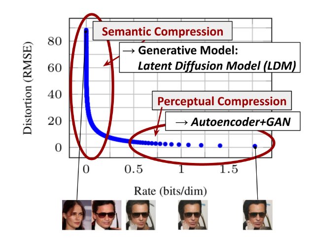
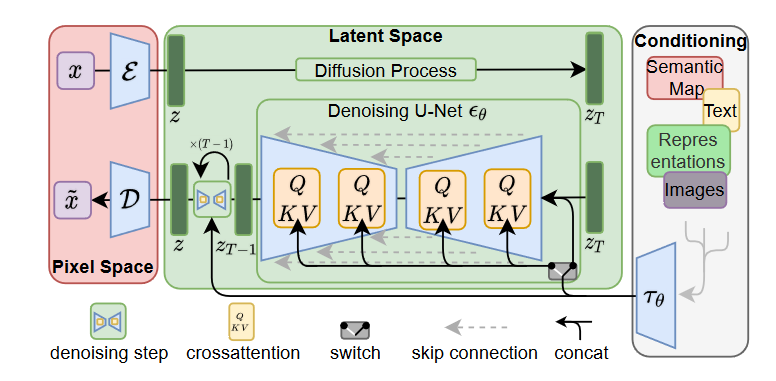
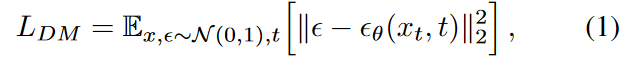
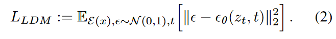
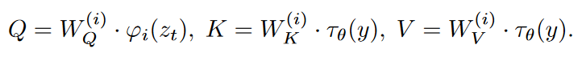
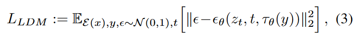

# 扩散模型

> 本篇内容基于论文High-Resolution Image Synthesis with Latent Diffusion Models，Robin Rombach，Andreas Blattmann，Dominik Lorenz，Patrick Esser，Bjorn Ommer

上图显示了训练模型的速率失真权衡（the rate-distortion trade-offl）。

 失真情况（纵轴）随着学习率（横轴）的变化分为两个阶段：

1. **Perceptual Compression 感知压缩阶段**：消除了高频细节
2. **Semantic Compression 语义压缩阶段**：实际的生成模型学习数据的语义和概念组成

我们的目标是找一个**感知上等效但计算上更合适的位置**（即接近转折点处），在这个位置训练用于高分辨率图像合成的扩散模型。

## 模型原理

### Perceptual Image Compression 感知图像压缩

Figure 1中左侧红色部分

- 编码器$\epsilon$：$z = \epsilon(x)$, 其中 $x\in \mathbb{R}^{H\times W\times 3}$为图像的RGB向量表示, $z\in \mathbb{R}^{h\times w\times c}$
- 解码器D：$\hat{x} = D(z) = D(\epsilon(x))$

- 下采样因数$f = H/h = W/w$, 通常使用$f = 2^m, m\in\mathbb{N}$

在此变换基础上，可以由扩散模型的损失函数（1）得到**潜在扩散模型的损失函数**（2）

其中：

- $\mathbb{E}_{x,\epsilon\sim\Nu(0,1),t}$表示在所有 x，噪声 ϵ（服从标准正态分布 (0,1)N(0,1)），和时间步 t 上取平均。
- $ \epsilon_{\theta}(x(t), t) $表示模型预测的噪声
- $\|\epsilon - \epsilon_{\theta}(x(t), t)\|^2$表示平方欧几里得距离，用于衡量模型预测的噪声与真实噪声之间的差异

这个损失函数的目标是最小化模型预测的噪声和真实噪声之间的差异。通过这种方式，模型学习如何逆转扩散过程，即从噪声数据 \( x(t) \) 重构出原始数据 \( x \)。这是通过优化模型参数 \( $\theta$ \) 来实现的，使得预测的噪声尽可能接近实际添加到数据中的噪声。

### Conditioning Mechanism 调节机制

通过结合扩散模型（DMs）和其他类型的条件输入，可以提高生成模型处理不同任务的能力。调节机制增强了U-Net基础架构，并引入了注意力机制。

Q，K，V是注意力机制的三个基本组成部分，这使模型能够基于输入的不同特征（由K和V表示）对信息（由Q查询）进行加权和整合。

- $\varphi_i(z_t)$：U-Net模型的一个中间表示

- $\tau$: 输入 *y* 的一个域特定的预处理函数, y为模型输入的条件
- $W_Q,W_K,W_V$是可学习的投影矩阵

据此可以把公式（2）扩展到公式（3），引入条件$\tau_{\theta}(y)$

## 实验

